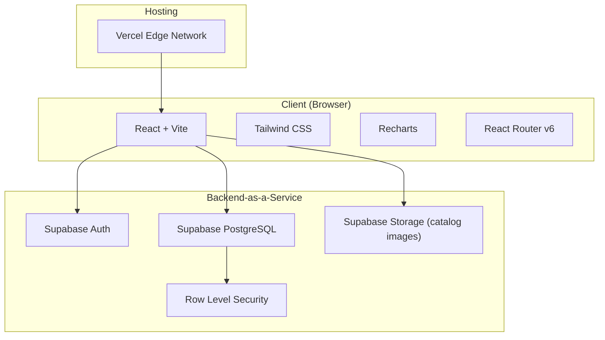
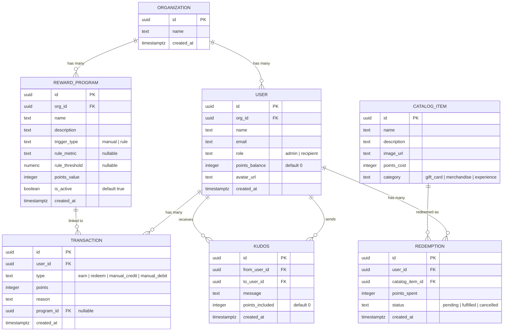
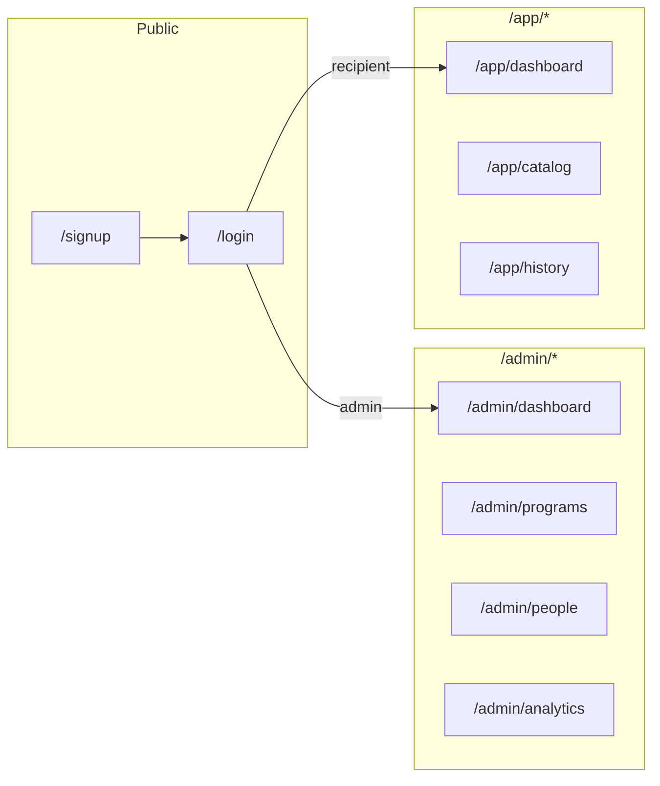
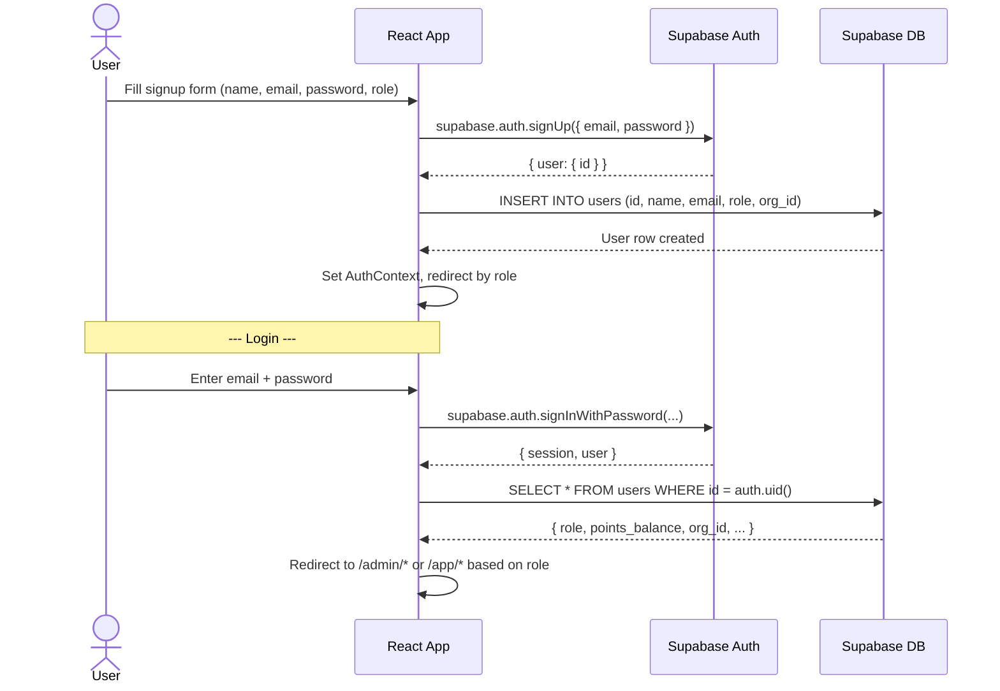
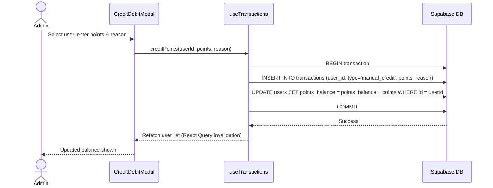
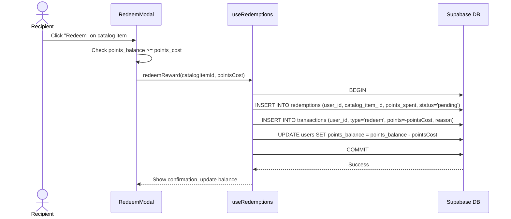
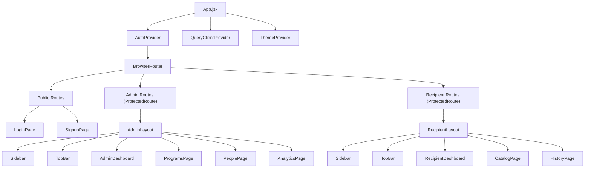
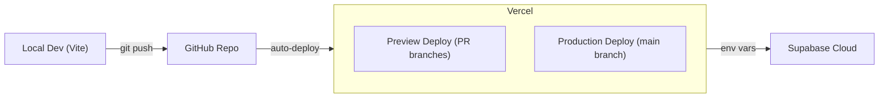

# Architecture: Xoxo — Rewards & Recognition Platform

## 1. System Overview

Xoxo follows a **client-heavy, BaaS-backed** architecture. The React frontend owns all UI logic, routing, and state, while Supabase provides authentication, a PostgreSQL database, and Row Level Security (RLS) — eliminating the need for a custom backend server.



### Why This Architecture?

| Decision | Rationale |
|----------|-----------|
| **No custom backend** | Supabase gives us auth + Postgres + RLS out of the box — building an Express/Node API adds complexity without portfolio value |
| **Supabase over Firebase** | PostgreSQL is relational — fits the R&R data model (joins, aggregations for analytics) far better than Firestore's document model |
| **Vite over CRA** | Faster dev server, smaller bundles, better DX — CRA is deprecated |
| **Recharts over Chart.js** | Recharts is React-native (declarative JSX), Chart.js requires imperative canvas wrappers |

---

## 2. Tech Stack (Finalized)

| Layer | Technology | Version | Purpose |
|-------|------------|---------|---------|
| **Build Tool** | Vite | ^5.x | Dev server, bundling, HMR |
| **UI Framework** | React | ^18.x | Component-based UI |
| **Routing** | React Router | v6 | Client-side page navigation |
| **Styling** | Tailwind CSS | ^3.x | Utility-first CSS framework |
| **State** | React Context + useReducer | — | Global state (auth, points balance) |
| **Data Fetching** | TanStack Query (React Query) | ^5.x | Caching, refetching, loading states for Supabase calls |
| **Charts** | Recharts | ^2.x | Analytics dashboard visualizations |
| **Auth + DB** | Supabase JS Client | ^2.x | Auth, PostgreSQL queries, storage |
| **Icons** | Lucide React | ^0.x | Consistent icon set |
| **Hosting** | Vercel | — | Edge deployment, preview URLs |

---

## 3. Project Structure

```
xoxo/
├── public/
│   └── favicon.svg
├── src/
│   ├── main.jsx                    # App entry point
│   ├── App.jsx                     # Root component, router setup
│   │
│   ├── config/
│   │   └── supabase.js             # Supabase client initialization
│   │
│   ├── context/
│   │   ├── AuthContext.jsx          # Auth state provider
│   │   └── ThemeContext.jsx         # Dark/light mode toggle
│   │
│   ├── hooks/
│   │   ├── useAuth.js              # Auth helper hook
│   │   ├── usePrograms.js          # Reward programs CRUD
│   │   ├── useTransactions.js      # Transaction queries
│   │   ├── useRedemptions.js       # Redemption flow
│   │   ├── usePeople.js            # People management queries
│   │   └── useAnalytics.js         # Aggregated analytics data
│   │
│   ├── components/
│   │   ├── layout/
│   │   │   ├── Sidebar.jsx         # Navigation sidebar
│   │   │   ├── TopBar.jsx          # Header with user info, notifications
│   │   │   ├── AdminLayout.jsx     # Layout wrapper for admin pages
│   │   │   └── RecipientLayout.jsx # Layout wrapper for recipient pages
│   │   │
│   │   ├── auth/
│   │   │   ├── LoginForm.jsx
│   │   │   ├── SignupForm.jsx
│   │   │   └── ProtectedRoute.jsx  # Role-gated route wrapper
│   │   │
│   │   ├── programs/
│   │   │   ├── ProgramCard.jsx     # Single program display
│   │   │   ├── ProgramForm.jsx     # Create/edit program modal
│   │   │   └── ProgramList.jsx     # Grid/list of all programs
│   │   │
│   │   ├── people/
│   │   │   ├── PeopleTable.jsx     # Employee/partner table
│   │   │   ├── CreditDebitModal.jsx# Manual point adjustment
│   │   │   └── UserHistory.jsx     # Individual transaction log
│   │   │
│   │   ├── catalog/
│   │   │   ├── CatalogGrid.jsx     # Reward items grid
│   │   │   ├── CatalogCard.jsx     # Single reward item
│   │   │   └── RedeemModal.jsx     # Confirmation + point deduction
│   │   │
│   │   ├── dashboard/
│   │   │   ├── PointsBalanceCard.jsx
│   │   │   ├── ActivityFeed.jsx    # Recent recognition/redemptions
│   │   │   └── QuickActions.jsx    # Shortcut buttons
│   │   │
│   │   ├── analytics/
│   │   │   ├── PointsIssuedVsRedeemed.jsx  # Bar/area chart
│   │   │   ├── RedemptionRateChart.jsx     # Line chart over time
│   │   │   ├── TopRecipientsTable.jsx      # Leaderboard table
│   │   │   └── ProgramBreakdown.jsx        # Pie/bar chart by program
│   │   │
│   │   └── shared/
│   │       ├── Button.jsx
│   │       ├── Modal.jsx
│   │       ├── Badge.jsx
│   │       ├── EmptyState.jsx
│   │       ├── LoadingSpinner.jsx
│   │       └── StatCard.jsx        # Metric display card
│   │
│   ├── pages/
│   │   ├── LoginPage.jsx
│   │   ├── SignupPage.jsx
│   │   ├── admin/
│   │   │   ├── AdminDashboard.jsx
│   │   │   ├── ProgramsPage.jsx
│   │   │   ├── PeoplePage.jsx
│   │   │   └── AnalyticsPage.jsx
│   │   └── recipient/
│   │       ├── RecipientDashboard.jsx
│   │       ├── CatalogPage.jsx
│   │       └── HistoryPage.jsx
│   │
│   ├── lib/
│   │   ├── constants.js            # App-wide constants, enums
│   │   ├── helpers.js              # Formatting, date utils
│   │   └── seed.js                 # Demo data seeding script
│   │
│   └── styles/
│       └── index.css               # Tailwind directives + custom styles
│
├── supabase/
│   └── migrations/
│       ├── 001_create_tables.sql   # Schema creation
│       ├── 002_rls_policies.sql    # Row Level Security policies
│       └── 003_seed_data.sql       # Demo data for live presentation
│
├── .env.local                      # VITE_SUPABASE_URL, VITE_SUPABASE_ANON_KEY
├── tailwind.config.js
├── vite.config.js
├── package.json
└── README.md
```

---

## 4. Database Schema (Supabase PostgreSQL)

### 4.1 Entity Relationship Diagram



### 4.2 SQL Schema

```sql
-- 001_create_tables.sql

-- Organizations
CREATE TABLE organizations (
    id          UUID PRIMARY KEY DEFAULT gen_random_uuid(),
    name        TEXT NOT NULL,
    created_at  TIMESTAMPTZ DEFAULT now()
);

-- Users (extends Supabase auth.users)
CREATE TABLE users (
    id              UUID PRIMARY KEY REFERENCES auth.users(id) ON DELETE CASCADE,
    org_id          UUID REFERENCES organizations(id) ON DELETE SET NULL,
    name            TEXT NOT NULL,
    email           TEXT UNIQUE NOT NULL,
    role            TEXT NOT NULL CHECK (role IN ('admin', 'recipient')),
    points_balance  INTEGER NOT NULL DEFAULT 0,
    avatar_url      TEXT,
    created_at      TIMESTAMPTZ DEFAULT now()
);

-- Reward Programs
CREATE TABLE reward_programs (
    id              UUID PRIMARY KEY DEFAULT gen_random_uuid(),
    org_id          UUID NOT NULL REFERENCES organizations(id) ON DELETE CASCADE,
    name            TEXT NOT NULL,
    description     TEXT,
    trigger_type    TEXT NOT NULL CHECK (trigger_type IN ('manual', 'rule')),
    rule_metric     TEXT,
    rule_threshold  NUMERIC,
    points_value    INTEGER NOT NULL CHECK (points_value > 0),
    is_active       BOOLEAN DEFAULT true,
    created_at      TIMESTAMPTZ DEFAULT now()
);

-- Transactions (point ledger)
CREATE TABLE transactions (
    id          UUID PRIMARY KEY DEFAULT gen_random_uuid(),
    user_id     UUID NOT NULL REFERENCES users(id) ON DELETE CASCADE,
    type        TEXT NOT NULL CHECK (type IN ('earn', 'redeem', 'manual_credit', 'manual_debit')),
    points      INTEGER NOT NULL,
    reason      TEXT,
    program_id  UUID REFERENCES reward_programs(id) ON DELETE SET NULL,
    created_at  TIMESTAMPTZ DEFAULT now()
);

-- Catalog Items
CREATE TABLE catalog_items (
    id          UUID PRIMARY KEY DEFAULT gen_random_uuid(),
    name        TEXT NOT NULL,
    description TEXT,
    image_url   TEXT,
    points_cost INTEGER NOT NULL CHECK (points_cost > 0),
    category    TEXT NOT NULL CHECK (category IN ('gift_card', 'merchandise', 'experience'))
);

-- Redemptions
CREATE TABLE redemptions (
    id              UUID PRIMARY KEY DEFAULT gen_random_uuid(),
    user_id         UUID NOT NULL REFERENCES users(id) ON DELETE CASCADE,
    catalog_item_id UUID NOT NULL REFERENCES catalog_items(id) ON DELETE CASCADE,
    points_spent    INTEGER NOT NULL,
    status          TEXT NOT NULL DEFAULT 'pending' CHECK (status IN ('pending', 'fulfilled', 'cancelled')),
    created_at      TIMESTAMPTZ DEFAULT now()
);

-- Kudos (stretch goal)
CREATE TABLE kudos (
    id              UUID PRIMARY KEY DEFAULT gen_random_uuid(),
    from_user_id    UUID NOT NULL REFERENCES users(id) ON DELETE CASCADE,
    to_user_id      UUID NOT NULL REFERENCES users(id) ON DELETE CASCADE,
    message         TEXT,
    points_included INTEGER DEFAULT 0,
    created_at      TIMESTAMPTZ DEFAULT now()
);

-- Indexes for common queries
CREATE INDEX idx_transactions_user_id ON transactions(user_id);
CREATE INDEX idx_transactions_created_at ON transactions(created_at DESC);
CREATE INDEX idx_transactions_type ON transactions(type);
CREATE INDEX idx_reward_programs_org_id ON reward_programs(org_id);
CREATE INDEX idx_users_org_id ON users(org_id);
CREATE INDEX idx_redemptions_user_id ON redemptions(user_id);
```

### 4.3 Row Level Security (RLS) Policies

```sql
-- 002_rls_policies.sql

ALTER TABLE users ENABLE ROW LEVEL SECURITY;
ALTER TABLE organizations ENABLE ROW LEVEL SECURITY;
ALTER TABLE reward_programs ENABLE ROW LEVEL SECURITY;
ALTER TABLE transactions ENABLE ROW LEVEL SECURITY;
ALTER TABLE catalog_items ENABLE ROW LEVEL SECURITY;
ALTER TABLE redemptions ENABLE ROW LEVEL SECURITY;

-- Users: can read own row; admins can read all users in their org
CREATE POLICY "Users can view own profile"
    ON users FOR SELECT
    USING (auth.uid() = id);

CREATE POLICY "Admins can view org users"
    ON users FOR SELECT
    USING (
        EXISTS (
            SELECT 1 FROM users u
            WHERE u.id = auth.uid()
            AND u.role = 'admin'
            AND u.org_id = users.org_id
        )
    );

-- Transactions: users see own; admins see all in org
CREATE POLICY "Users view own transactions"
    ON transactions FOR SELECT
    USING (user_id = auth.uid());

CREATE POLICY "Admins view org transactions"
    ON transactions FOR SELECT
    USING (
        EXISTS (
            SELECT 1 FROM users u
            WHERE u.id = auth.uid()
            AND u.role = 'admin'
            AND u.org_id = (SELECT org_id FROM users WHERE id = transactions.user_id)
        )
    );

-- Admins can insert transactions (manual credit/debit)
CREATE POLICY "Admins can insert transactions"
    ON transactions FOR INSERT
    WITH CHECK (
        EXISTS (
            SELECT 1 FROM users u
            WHERE u.id = auth.uid()
            AND u.role = 'admin'
        )
    );

-- Catalog items: readable by everyone (public catalog)
CREATE POLICY "Anyone can view catalog"
    ON catalog_items FOR SELECT
    USING (true);

-- Redemptions: users can insert for themselves; admins can view all in org
CREATE POLICY "Users can redeem for themselves"
    ON redemptions FOR INSERT
    WITH CHECK (user_id = auth.uid());

CREATE POLICY "Users view own redemptions"
    ON redemptions FOR SELECT
    USING (user_id = auth.uid());

-- Reward programs: admins CRUD within org; recipients can view active programs
CREATE POLICY "Admins manage programs"
    ON reward_programs FOR ALL
    USING (
        EXISTS (
            SELECT 1 FROM users u
            WHERE u.id = auth.uid()
            AND u.role = 'admin'
            AND u.org_id = reward_programs.org_id
        )
    );

CREATE POLICY "Recipients view active programs"
    ON reward_programs FOR SELECT
    USING (is_active = true);
```

---

## 5. Routing & Page Map



### Route Definitions

| Route | Component | Auth | Role |
|-------|-----------|------|------|
| `/login` | `LoginPage` | Public | — |
| `/signup` | `SignupPage` | Public | — |
| `/admin/dashboard` | `AdminDashboard` | Required | Admin |
| `/admin/programs` | `ProgramsPage` | Required | Admin |
| `/admin/people` | `PeoplePage` | Required | Admin |
| `/admin/analytics` | `AnalyticsPage` | Required | Admin |
| `/app/dashboard` | `RecipientDashboard` | Required | Recipient |
| `/app/catalog` | `CatalogPage` | Required | Recipient |
| `/app/history` | `HistoryPage` | Required | Recipient |

### Route Protection

```jsx
// ProtectedRoute.jsx — wraps role-gated routes
<Route element={<ProtectedRoute allowedRoles={['admin']} />}>
    <Route path="/admin/dashboard" element={<AdminDashboard />} />
    ...
</Route>
```

---

## 6. Authentication Flow



### Auth State Management

```jsx
// AuthContext.jsx
const AuthContext = createContext(null);

function AuthProvider({ children }) {
    const [user, setUser] = useState(null);       // Supabase auth user
    const [profile, setProfile] = useState(null);  // users table row
    const [loading, setLoading] = useState(true);

    useEffect(() => {
        // Listen for auth state changes
        const { data: { subscription } } = supabase.auth.onAuthStateChange(
            async (event, session) => {
                if (session?.user) {
                    setUser(session.user);
                    const { data } = await supabase
                        .from('users')
                        .select('*')
                        .eq('id', session.user.id)
                        .single();
                    setProfile(data);
                } else {
                    setUser(null);
                    setProfile(null);
                }
                setLoading(false);
            }
        );
        return () => subscription.unsubscribe();
    }, []);

    return (
        <AuthContext.Provider value={{ user, profile, loading }}>
            {children}
        </AuthContext.Provider>
    );
}
```

---

## 7. Core Data Flows

### 7.1 Manual Point Credit (Admin → Recipient)



> **Important**: The `points_balance` on the `users` table is a **denormalized cache** for fast reads. The `transactions` table is the **source of truth**. A Supabase database function wraps both operations in a single `PERFORM` to ensure atomicity.

### 7.2 Reward Redemption (Recipient)



### 7.3 Analytics Aggregation

Analytics queries run directly against the `transactions` table using Supabase's `.rpc()` to call PostgreSQL functions:

```sql
-- Total points issued vs redeemed (for charts)
CREATE OR REPLACE FUNCTION get_points_summary(org UUID)
RETURNS TABLE(month TEXT, issued BIGINT, redeemed BIGINT) AS $$
    SELECT
        to_char(created_at, 'YYYY-MM') AS month,
        SUM(CASE WHEN type IN ('earn', 'manual_credit') THEN points ELSE 0 END) AS issued,
        SUM(CASE WHEN type = 'redeem' THEN ABS(points) ELSE 0 END) AS redeemed
    FROM transactions t
    JOIN users u ON t.user_id = u.id
    WHERE u.org_id = org
    GROUP BY month
    ORDER BY month;
$$ LANGUAGE sql STABLE;

-- Top recipients
CREATE OR REPLACE FUNCTION get_top_recipients(org UUID, lim INT DEFAULT 10)
RETURNS TABLE(user_id UUID, user_name TEXT, total_earned BIGINT) AS $$
    SELECT
        u.id AS user_id,
        u.name AS user_name,
        SUM(t.points) AS total_earned
    FROM transactions t
    JOIN users u ON t.user_id = u.id
    WHERE u.org_id = org AND t.type IN ('earn', 'manual_credit')
    GROUP BY u.id, u.name
    ORDER BY total_earned DESC
    LIMIT lim;
$$ LANGUAGE sql STABLE;
```

---

## 8. State Management Strategy

| State Type | Solution | Scope |
|------------|----------|-------|
| **Auth state** | `AuthContext` (React Context) | Global — user session, profile, role |
| **Server state** (lists, records) | TanStack Query | Per-component — auto caching, refetch on focus |
| **UI state** (modals, forms) | `useState` / `useReducer` | Local component |
| **Theme** | `ThemeContext` | Global — dark/light mode preference |

### Why TanStack Query?

- **No manual loading/error state** — `useQuery` handles `isLoading`, `isError`, `data` automatically
- **Cache invalidation** — after a mutation (credit points, create program), call `queryClient.invalidateQueries(['users'])` to refetch
- **Stale-while-revalidate** — instant perceived performance with background refetch
- **Deduplication** — multiple components requesting the same data share one network call

```jsx
// Example: usePrograms.js
export function usePrograms(orgId) {
    return useQuery({
        queryKey: ['programs', orgId],
        queryFn: async () => {
            const { data, error } = await supabase
                .from('reward_programs')
                .select('*')
                .eq('org_id', orgId)
                .order('created_at', { ascending: false });
            if (error) throw error;
            return data;
        },
        enabled: !!orgId,
    });
}
```

---

## 9. Component Architecture



---

## 10. Supabase Database Functions (RPC)

These server-side functions ensure atomicity for multi-step operations:

| Function | Purpose | Called By |
|----------|---------|-----------|
| `credit_points(user_id, points, reason, program_id?)` | Atomically insert transaction + update balance | Admin: CreditDebitModal |
| `debit_points(user_id, points, reason)` | Atomically insert transaction + update balance (negative) | Admin: CreditDebitModal |
| `redeem_reward(user_id, catalog_item_id, points_cost)` | Insert redemption + transaction + update balance | Recipient: RedeemModal |
| `get_points_summary(org_id)` | Monthly issued vs redeemed aggregation | Admin: AnalyticsPage |
| `get_top_recipients(org_id, limit)` | Leaderboard query | Admin: AnalyticsPage |
| `get_program_breakdown(org_id)` | Points earned per program | Admin: AnalyticsPage |

---

## 11. Seeding Strategy

The app must feel **alive on first load** for portfolio demonstrations. The seed script ([003_seed_data.sql](file:///c:/Users/KIIT0001/Desktop/PM Projects/Xoxo/supabase/migrations/003_seed_data.sql)) will populate:

| Entity | Count | Notes |
|--------|-------|-------|
| Organizations | 1 | "Acme Corp" |
| Admin users | 2 | HR Manager, Team Lead |
| Recipient users | 8–10 | Mix of employees and channel partners |
| Reward programs | 4 | Sales target, peer kudos, work anniversary, quarterly bonus |
| Transactions | 50–80 | Spread over past 6 months for meaningful charts |
| Catalog items | 6–8 | Gift cards, merchandise, experiences with images |
| Redemptions | 10–15 | Various statuses |

A companion `src/lib/seed.js` file will also be available for client-side seeding during development.

---

## 12. Deployment Pipeline



### Environment Variables

| Variable | Source | Description |
|----------|--------|-------------|
| `VITE_SUPABASE_URL` | Supabase Dashboard → Settings → API | Project URL |
| `VITE_SUPABASE_ANON_KEY` | Supabase Dashboard → Settings → API | Public anon key (safe for client — RLS protects data) |

### Build & Deploy Commands

```bash
# Install
npm install

# Local development
npm run dev         # → http://localhost:5173

# Production build
npm run build       # → dist/

# Preview production build locally
npm run preview
```

---

## 13. Performance Considerations

| Concern | Mitigation |
|---------|------------|
| **Large transaction tables** | Indexed on `user_id`, `created_at`, `type`; paginated queries with `.range()` |
| **Analytics query speed** | Pre-aggregated via PostgreSQL functions; consider materialized views if scale demands |
| **Bundle size** | Vite tree-shaking; lazy-load admin pages with `React.lazy()` + `Suspense` |
| **Image loading (catalog)** | Supabase Storage with CDN; use `loading="lazy"` on `` tags |
| **Frequent balance reads** | `points_balance` denormalized on `users` table — single-row read, no SUM aggregation |

---

## 14. Security Model

| Layer | Implementation |
|-------|---------------|
| **Authentication** | Supabase Auth (email/password); JWT-based sessions |
| **Authorization** | RLS policies on every table — queries automatically scoped to user's org + role |
| **API key exposure** | Only `anon` key in client — safe because RLS enforces all access rules server-side |
| **Input validation** | PostgreSQL `CHECK` constraints + client-side form validation |
| **XSS prevention** | React's default escaping; no `dangerouslySetInnerHTML` |

---

## 15. Future Architecture Considerations (Post-MVP)

These are **not in scope** for the MVP but inform architectural decisions made now:

| Feature | Architectural Impact |
|---------|---------------------|
| **Real-time notifications** | Supabase Realtime (already supported by the client) — subscribe to `transactions` inserts |
| **Webhooks for rule-based triggers** | Supabase Edge Functions — evaluate rules on external events |
| **Multi-org support** | Already modeled via `org_id` foreign keys and RLS |
| **Audit log** | `transactions` table already serves as an append-only ledger |
| **Export (CSV/PDF)** | Client-side generation with `papaparse` / `jspdf` — no backend needed |
