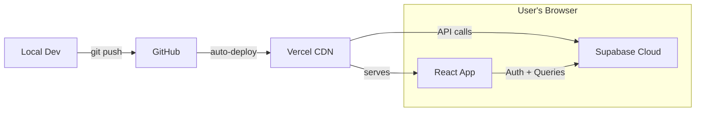
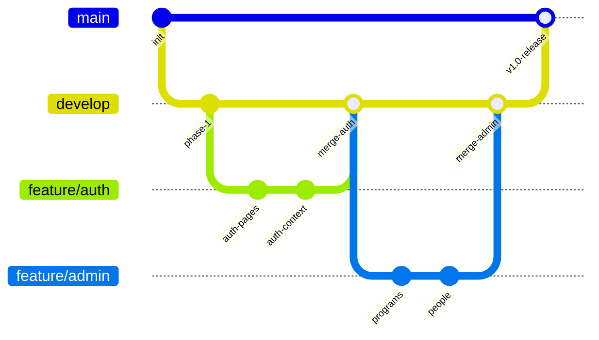
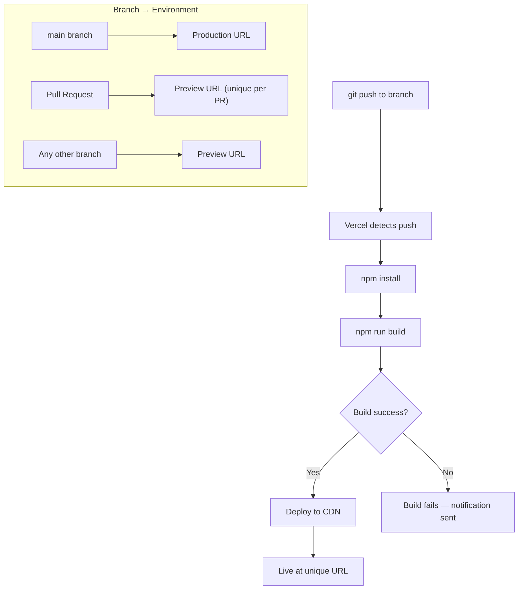

# Deployment Plan: Kudos — Rewards & Recognition Platform

## Overview

This document covers the complete deployment pipeline — from local development through production launch. Kudos uses a **two-service architecture**: a static React frontend on **Vercel** and a managed backend on **Supabase Cloud**. There are no custom servers to provision or manage.



---

## 1. Prerequisites

### 1.1 Accounts Required

| Service | Purpose | Plan | Sign Up |
|---------|---------|------|---------|
| **GitHub** | Source code repository | Free | [github.com](https://github.com) |
| **Supabase** | Auth + PostgreSQL database + Storage | Free tier (500MB DB, 1GB storage, 50k auth users) | [supabase.com](https://supabase.com) |
| **Vercel** | Frontend hosting + CDN | Hobby (free for personal projects) | [vercel.com](https://vercel.com) |

### 1.2 Local Tooling

| Tool | Version | Purpose |
|------|---------|---------|
| **Node.js** | ≥ 18.x | Runtime for build tools |
| **npm** | ≥ 9.x | Package management |
| **Git** | ≥ 2.x | Version control |
| **Vercel CLI** (optional) | Latest | Local preview + deploy from terminal |

```bash
# Verify local tooling
node --version    # ≥ 18.x
npm --version     # ≥ 9.x
git --version     # ≥ 2.x
```

---

## 2. Supabase Setup (Backend)

### 2.1 Create Project

| Step | Action |
|------|--------|
| 1 | Log in to [supabase.com/dashboard](https://supabase.com/dashboard) |
| 2 | Click **"New Project"** |
| 3 | **Organization**: Select or create one |
| 4 | **Project name**: `kudos-rewards` |
| 5 | **Database password**: Generate a strong password → **save it securely** |
| 6 | **Region**: Choose closest to target users (e.g., `ap-south-1` for India, `us-east-1` for US) |
| 7 | Click **"Create new project"** → wait ~2 minutes for provisioning |

### 2.2 Retrieve API Credentials

Navigate to **Settings → API** in the Supabase dashboard:

| Credential | Where to Find | Environment Variable |
|------------|--------------|---------------------|
| **Project URL** | Settings → API → Project URL | `VITE_SUPABASE_URL` |
| **Anon Key** | Settings → API → `anon` `public` key | `VITE_SUPABASE_ANON_KEY` |
| **Service Role Key** | Settings → API → `service_role` key | **Never expose in client code** — admin-only operations |

> [!CAUTION]
> The `service_role` key bypasses all RLS policies. **Never** include it in frontend code or commit it to Git. It is only used for server-side scripts (e.g., seeding).

### 2.3 Configure Authentication

Navigate to **Authentication → Providers**:

| Setting | Value | Reason |
|---------|-------|--------|
| **Email Provider** | Enabled | Primary auth method |
| **Confirm email** | Disabled (for dev) | Removes friction during development/demo |
| **Minimum password length** | 6 | Balance between security and demo convenience |
| **Enable signup** | Enabled | Users need to self-register |

> [!TIP]
> Re-enable email confirmation for production deployments where real users will sign up.

### 2.4 Run Database Migrations

Execute the SQL migration files in order via **SQL Editor** (Supabase Dashboard → SQL Editor → New Query):

| Order | File | What It Does | Estimated Time |
|-------|------|-------------|----------------|
| 1 | `001_create_tables.sql` | Creates 7 tables with constraints, indexes | ~5s |
| 2 | `002_rls_policies.sql` | Enables RLS + creates all access policies | ~3s |
| 3 | `003_rpc_functions.sql` | Creates atomic functions (credit, debit, redeem, analytics) | ~3s |
| 4 | `004_seed_data.sql` | Populates demo data (org, users, programs, transactions, catalog) | ~5s |

**Verification after each migration**:

```sql
-- After 001: Verify tables exist
SELECT table_name FROM information_schema.tables 
WHERE table_schema = 'public' ORDER BY table_name;
-- Expected: catalog_items, kudos, organizations, redemptions, reward_programs, transactions, users

-- After 002: Verify RLS is enabled
SELECT tablename, rowsecurity FROM pg_tables 
WHERE schemaname = 'public' AND rowsecurity = true;
-- Expected: all 7 tables listed

-- After 003: Verify functions exist
SELECT routine_name FROM information_schema.routines 
WHERE routine_schema = 'public';
-- Expected: credit_points, debit_points, redeem_reward, get_points_summary, get_top_recipients, get_program_breakdown

-- After 004: Verify seed data
SELECT COUNT(*) FROM users;          -- Expected: 10-12
SELECT COUNT(*) FROM transactions;   -- Expected: 50-80
SELECT COUNT(*) FROM catalog_items;  -- Expected: 6-8
```

### 2.5 Upload Catalog Images

Navigate to **Storage → Create Bucket**:

| Setting | Value |
|---------|-------|
| **Bucket name** | `catalog-images` |
| **Public** | Yes (images need to be publicly accessible) |
| **File size limit** | 2MB |
| **Allowed MIME types** | `image/png, image/jpeg, image/webp` |

Upload 6–8 reward images → copy their public URLs → update `catalog_items.image_url` in the database.

### 2.6 Supabase Configuration Checklist

- [ ] Project created and provisioned
- [ ] API credentials (URL + anon key) copied
- [ ] Email auth enabled with confirmation disabled
- [ ] All 4 SQL migrations executed successfully
- [ ] All 7 tables have RLS enabled
- [ ] RPC functions exist and are callable
- [ ] Seed data is populated
- [ ] Catalog images uploaded to Storage
- [ ] Storage bucket is public

---

## 3. GitHub Repository Setup

### 3.1 Initialize Repository

```bash
# From the project root
git init
git add .
git commit -m "Initial commit: Kudos R&R Platform MVP"

# Create repo on GitHub (via CLI or web)
gh repo create kudos-rewards --public --source=. --push
# OR
git remote add origin https://github.com/<username>/kudos-rewards.git
git push -u origin main
```

### 3.2 Branch Strategy

| Branch | Purpose | Deploys To |
|--------|---------|-----------|
| `main` | Production-ready code | Vercel Production |
| `develop` | Integration branch for features | Vercel Preview |
| `feature/*` | Individual feature branches | Vercel Preview (per-PR) |



### 3.3 `.gitignore`

```gitignore
# Dependencies
node_modules/

# Build output
dist/

# Environment variables
.env
.env.local
.env.*.local

# IDE
.vscode/
.idea/

# OS
.DS_Store
Thumbs.db

# Logs
*.log
npm-debug.log*
```

### 3.4 `.env.local` Template

Create but **do not commit** this file:

```env
# Supabase Configuration
VITE_SUPABASE_URL=https://your-project-id.supabase.co
VITE_SUPABASE_ANON_KEY=eyJhbGciOiJIUzI1NiIsInR5cCI6IkpXVCJ9...

# Optional: Analytics, feature flags, etc.
VITE_APP_ENV=development
```

> [!IMPORTANT]
> Add `.env.local` to `.gitignore`. Never commit API keys to version control, even anon keys — treat them as configuration, not code.

---

## 4. Vercel Deployment

### 4.1 Connect Repository

| Step | Action |
|------|--------|
| 1 | Log in to [vercel.com/dashboard](https://vercel.com/dashboard) |
| 2 | Click **"Add New Project"** |
| 3 | Select **"Import Git Repository"** → choose `kudos-rewards` |
| 4 | **Framework Preset**: Vite (auto-detected) |
| 5 | **Root Directory**: `./` (default) |
| 6 | **Build Command**: `npm run build` |
| 7 | **Output Directory**: `dist` |
| 8 | **Install Command**: `npm install` |

### 4.2 Environment Variables

Add these in Vercel → Project Settings → Environment Variables:

| Variable | Value | Environments |
|----------|-------|-------------|
| `VITE_SUPABASE_URL` | `https://your-project-id.supabase.co` | Production, Preview, Development |
| `VITE_SUPABASE_ANON_KEY` | `eyJhbGci...` | Production, Preview, Development |

> [!NOTE]
> Vercel automatically injects `VITE_`-prefixed variables into the Vite build process. Non-prefixed variables are only available server-side (not applicable for this project).

### 4.3 Build Configuration

Vercel auto-detects Vite projects. Verify these settings:

```json
{
    "buildCommand": "npm run build",
    "outputDirectory": "dist",
    "installCommand": "npm install",
    "framework": "vite"
}
```

### 4.4 SPA Routing Configuration

React Router uses client-side routing — all routes must resolve to `index.html`. Create a `vercel.json` in the project root:

```json
{
    "rewrites": [
        { "source": "/(.*)", "destination": "/index.html" }
    ]
}
```

> [!WARNING]
> Without this rewrite rule, navigating directly to `/admin/dashboard` or refreshing on any route will return a **404**. This is the most common deployment issue for SPAs on Vercel.

### 4.5 Deploy

```bash
# Option A: Auto-deploy via Git push
git push origin main
# Vercel automatically builds and deploys on push to main

# Option B: Manual deploy via CLI
npx vercel --prod

# Option C: Preview deploy (for testing)
npx vercel
```

### 4.6 Deployment Verification

After deployment, verify at the production URL:

| Check | URL | Expected |
|-------|-----|----------|
| Home page loads | `https://kudos-rewards.vercel.app/` | Redirect to `/login` |
| Login page renders | `https://kudos-rewards.vercel.app/login` | Login form visible |
| Direct route access | `https://kudos-rewards.vercel.app/admin/dashboard` | Redirect to `/login` (if not authenticated) |
| Supabase connection | Open DevTools → Network | No failed API calls to `supabase.co` |
| No console errors | Open DevTools → Console | Zero errors |

### 4.7 Vercel Deployment Checklist

- [ ] Repository imported into Vercel
- [ ] Framework detected as Vite
- [ ] Build command: `npm run build`
- [ ] Output directory: `dist`
- [ ] Environment variables set (URL + anon key)
- [ ] `vercel.json` with SPA rewrite rule committed
- [ ] Production deployment successful
- [ ] All routes resolve correctly (no 404s on refresh)
- [ ] Supabase API calls succeeding from production domain

---

## 5. Domain Configuration (Optional)

### 5.1 Custom Domain

| Step | Action |
|------|--------|
| 1 | Vercel Dashboard → Project → Settings → Domains |
| 2 | Add custom domain (e.g., `kudos.yourdomain.com`) |
| 3 | Configure DNS: Add CNAME record pointing to `cname.vercel-dns.com` |
| 4 | Wait for DNS propagation (~5–30 minutes) |
| 5 | Vercel auto-provisions SSL certificate (Let's Encrypt) |

### 5.2 DNS Records

| Type | Host | Value | TTL |
|------|------|-------|-----|
| CNAME | `kudos` | `cname.vercel-dns.com` | 300 |

OR for apex domain:

| Type | Host | Value | TTL |
|------|------|-------|-----|
| A | `@` | `76.76.21.21` | 300 |

---

## 6. Supabase URL Allowlisting

After deploying to Vercel, configure Supabase to accept requests from your production domain:

Navigate to **Supabase Dashboard → Authentication → URL Configuration**:

| Setting | Value |
|---------|-------|
| **Site URL** | `https://kudos-rewards.vercel.app` (or custom domain) |
| **Redirect URLs** | `https://kudos-rewards.vercel.app/**` |
| **Additional redirect URLs** | `http://localhost:5173/**` (for local dev) |

> [!IMPORTANT]
> If this is not configured, auth redirects (password reset, email confirmation) will fail in production.

---

## 7. CI/CD Pipeline

### 7.1 Automatic Deployments

Vercel handles CI/CD automatically:



| Trigger | Environment | URL |
|---------|-------------|-----|
| Push to `main` | Production | `kudos-rewards.vercel.app` |
| Push to any other branch | Preview | `kudos-rewards-<hash>.vercel.app` |
| Pull Request | Preview | `kudos-rewards-<pr-number>.vercel.app` |

### 7.2 Build Validation Script

Add a pre-deploy validation script to `package.json`:

```json
{
    "scripts": {
        "dev": "vite",
        "build": "vite build",
        "preview": "vite preview",
        "lint": "eslint src/ --ext .js,.jsx",
        "typecheck": "tsc --noEmit",
        "validate": "npm run lint && npm run build"
    }
}
```

### 7.3 GitHub Actions (Optional Enhancement)

For additional CI checks before Vercel deploys:

```yaml
# .github/workflows/ci.yml
name: CI

on:
    push:
        branches: [main, develop]
    pull_request:
        branches: [main]

jobs:
    validate:
        runs-on: ubuntu-latest
        steps:
            - uses: actions/checkout@v4
            - uses: actions/setup-node@v4
              with:
                  node-version: 18
                  cache: 'npm'
            - run: npm ci
            - run: npm run lint
            - run: npm run build
              env:
                  VITE_SUPABASE_URL: ${{ secrets.VITE_SUPABASE_URL }}
                  VITE_SUPABASE_ANON_KEY: ${{ secrets.VITE_SUPABASE_ANON_KEY }}
```

---

## 8. Environment Management

### 8.1 Environment Matrix

| Environment | Supabase Project | Vercel Target | Purpose |
|-------------|-----------------|---------------|---------|
| **Local Dev** | `kudos-dev` (or shared) | N/A | Development + testing |
| **Preview** | `kudos-dev` | Vercel Preview | PR review + QA |
| **Production** | `kudos-prod` | Vercel Production | Live demo + portfolio |

> [!TIP]
> For a portfolio project, a single Supabase project shared across all environments is acceptable. For a real product, use separate projects for dev/staging/production.

### 8.2 Environment Variable Reference

| Variable | Local | Preview | Production | Sensitive? |
|----------|-------|---------|------------|-----------|
| `VITE_SUPABASE_URL` | `.env.local` | Vercel env vars | Vercel env vars | No (public) |
| `VITE_SUPABASE_ANON_KEY` | `.env.local` | Vercel env vars | Vercel env vars | No (public, RLS-protected) |
| `SUPABASE_SERVICE_ROLE_KEY` | `.env.local` | **Not set** | **Not set** | **Yes — never in client** |
| `VITE_APP_ENV` | `development` | `preview` | `production` | No |

---

## 9. Monitoring & Observability

### 9.1 Vercel Analytics (Built-in)

Enable in Vercel Dashboard → Project → Analytics:

| Metric | What It Tracks |
|--------|---------------|
| **Web Vitals** | FCP, LCP, CLS, FID, TTFB |
| **Page Views** | Route-level traffic |
| **Unique Visitors** | Daily/weekly/monthly visitors |
| **Speed Insights** | Per-route performance breakdown |

### 9.2 Supabase Dashboard Monitoring

| Metric | Where | What to Watch |
|--------|-------|--------------|
| **Database Size** | Settings → Database | Stay under 500MB (free tier) |
| **API Requests** | Reports → API | Request volume + error rates |
| **Auth Users** | Authentication → Users | Total signups |
| **Storage** | Storage | Image bucket usage |
| **Edge Function Invocations** | Edge Functions | N/A for MVP (no edge functions) |

### 9.3 Client-Side Error Tracking

Add basic error tracking in the React app:

```jsx
// src/main.jsx — Global error handler
window.addEventListener('unhandledrejection', (event) => {
    console.error('Unhandled promise rejection:', event.reason);
    // Future: send to error tracking service (Sentry, LogRocket)
});

// React Error Boundary wraps the entire app
<ErrorBoundary fallback={<ErrorFallback />}>
    <App />
</ErrorBoundary>
```

### 9.4 Health Check Endpoints

Since there's no custom backend, health is determined by:

| Check | Method | Expected |
|-------|--------|----------|
| **Frontend loads** | Visit production URL | Login page renders |
| **Supabase API** | Supabase Dashboard → Health | All services green |
| **Auth works** | Test login with demo credentials | Session created |
| **DB queries work** | Load any page with data | Data renders |

---

## 10. Rollback Strategy

### 10.1 Frontend Rollback (Vercel)

| Method | Steps | Speed |
|--------|-------|-------|
| **Instant Rollback** | Vercel Dashboard → Deployments → select previous deployment → **"Promote to Production"** | < 30 seconds |
| **Git Revert** | `git revert <commit>` → push to main → auto-deploy | ~2 minutes |
| **Branch Reset** | `git reset --hard <commit>` → `git push -f origin main` | ~2 minutes |

> [!TIP]
> Vercel keeps every deployment forever (on free tier). You can instantly roll back to any previous deployment without touching Git.

### 10.2 Database Rollback (Supabase)

| Scenario | Method |
|----------|--------|
| **Bad migration** | Write a reverse migration SQL script and execute in SQL Editor |
| **Bad seed data** | `TRUNCATE` affected tables → re-run seed script |
| **Accidental data deletion** | Supabase Point-in-Time Recovery (Pro plan) — not available on free tier |
| **Full reset** | Drop all tables → re-run all migrations + seed |

```sql
-- Nuclear option: Full database reset
DROP SCHEMA public CASCADE;
CREATE SCHEMA public;
GRANT ALL ON SCHEMA public TO postgres;
GRANT ALL ON SCHEMA public TO public;
-- Then re-run all 4 migration files in order
```

> [!CAUTION]
> The nuclear option deletes ALL data. Only use this in development or if the database is unrecoverably broken.

---

## 11. Pre-Launch Checklist

### 11.1 Before Going Live

**Supabase**:
- [ ] All migrations executed without errors
- [ ] RLS enabled on all 7 tables
- [ ] RPC functions created and tested
- [ ] Seed data populated
- [ ] Catalog images uploaded
- [ ] Site URL configured to production domain
- [ ] Redirect URLs include production + localhost

**Frontend**:
- [ ] `vercel.json` with SPA rewrite rule committed
- [ ] No hardcoded API URLs (all from `VITE_` env vars)
- [ ] No `console.log` statements in production code (or gated by `VITE_APP_ENV`)
- [ ] Error boundary wraps entire app
- [ ] `<noscript>` message in `index.html`
- [ ] Favicon set
- [ ] `<title>` and `<meta>` tags configured for SEO

**Vercel**:
- [ ] Environment variables set for production
- [ ] Build succeeds with no warnings
- [ ] Production deployment live at public URL

**Testing**:
- [ ] Login works on production
- [ ] Admin flow: create program → credit points
- [ ] Recipient flow: view balance → redeem reward
- [ ] Analytics charts render with seed data
- [ ] All pages work on mobile (375px viewport)
- [ ] Dark mode works
- [ ] No console errors

### 11.2 Post-Launch Verification

| Check | Action | Pass Criteria |
|-------|--------|---------------|
| **URL accessible** | Visit production URL from incognito browser | Login page loads in < 2s |
| **SSL** | Check browser padlock icon | Valid HTTPS certificate |
| **SEO** | View page source | `<title>`, `<meta description>` present |
| **Performance** | Run Lighthouse in Chrome DevTools | Score ≥ 80 for Performance |
| **E2E flow** | Run E2E-01 + E2E-02 from [evals.md](file:///c:/Users/KIIT0001/Desktop/PM%20Projects/Kudos/evals.md) | Both pass |
| **Cross-browser** | Test in Chrome, Firefox, Safari | No layout breaks |
| **Mobile** | Test on actual phone or Chrome mobile emulation | All pages usable |

---

## 12. Deployment Timeline

```mermaid
gantt
    title Deployment Timeline
    dateFormat HH:mm
    axisFormat %H:%M

    section Supabase
    Create project & configure auth     :s1, 00:00, 15min
    Run migrations (4 files)            :s2, after s1, 10min
    Upload catalog images               :s3, after s2, 10min
    Verify seed data                    :s4, after s3, 5min

    section GitHub
    Push code to repository             :g1, after s4, 5min

    section Vercel
    Import repo & configure             :v1, after g1, 10min
    Set environment variables           :v2, after v1, 5min
    First deployment                    :v3, after v2, 3min
    Verify deployment                   :v4, after v3, 10min

    section Post-Launch
    Run E2E tests                       :p1, after v4, 15min
    Cross-browser check                 :p2, after p1, 10min
    Update README with live URL         :p3, after p2, 5min
```



**Total estimated deployment time**: ~90 minutes (first-time setup)
**Subsequent deployments**: ~3 minutes (auto-deploy on git push)

---

## 13. Troubleshooting Common Issues

| Issue | Symptom | Solution |
|-------|---------|----------|
| **404 on page refresh** | Navigating directly to `/admin/dashboard` returns 404 | Add `vercel.json` with SPA rewrite rule (Section 4.4) |
| **Blank page on load** | White screen, no content | Check browser console for errors; verify `VITE_SUPABASE_URL` is set correctly in Vercel |
| **"Invalid API key"** | Supabase calls return 401 | Verify `VITE_SUPABASE_ANON_KEY` in Vercel env vars; ensure it matches the anon key (not service role) |
| **CORS errors** | Browser blocks Supabase requests | Supabase handles CORS automatically; if custom domain, check Site URL config (Section 6) |
| **Auth redirects to wrong URL** | After login, redirected to localhost instead of production | Update Site URL in Supabase Auth settings (Section 6) |
| **Build fails on Vercel** | Deployment errors | Run `npm run build` locally first; check for TypeScript/ESLint errors; verify all imports exist |
| **Images not loading** | Broken image icons in catalog | Verify Storage bucket is public; check `image_url` values in `catalog_items` table |
| **RLS blocks all queries** | Data doesn't load; empty tables shown | Check RLS policies in Supabase; test with `service_role` key in SQL Editor to confirm data exists |
| **Seed data missing** | Empty charts, no users | Re-run `004_seed_data.sql` in Supabase SQL Editor |
| **Slow initial load** | Page takes > 3s to render | Check bundle size with `npx vite-bundle-analyzer`; ensure lazy loading is configured |

---

## 14. Security Hardening (Production)

| Measure | Status | Notes |
|---------|--------|-------|
| **HTTPS enforced** | ✅ Automatic | Vercel provisions SSL via Let's Encrypt |
| **RLS on all tables** | ✅ Required | Verified in migration `002_rls_policies.sql` |
| **No secrets in client** | ✅ By design | Only anon key (public) in frontend |
| **CSP headers** | ⚠️ Optional | Add via `vercel.json` headers if needed |
| **Rate limiting** | ✅ Built-in | Supabase rate limits auth + API by default |
| **Input validation** | ✅ Dual layer | Client-side form validation + DB CHECK constraints |
| **XSS prevention** | ✅ React default | JSX auto-escaping; no `dangerouslySetInnerHTML` |
| **Dependency audit** | ⚠️ Recommended | Run `npm audit` before each deploy |

### Optional: Security Headers

Add to `vercel.json`:

```json
{
    "headers": [
        {
            "source": "/(.*)",
            "headers": [
                { "key": "X-Content-Type-Options", "value": "nosniff" },
                { "key": "X-Frame-Options", "value": "DENY" },
                { "key": "X-XSS-Protection", "value": "1; mode=block" },
                { "key": "Referrer-Policy", "value": "strict-origin-when-cross-origin" },
                { "key": "Permissions-Policy", "value": "camera=(), microphone=(), geolocation=()" }
            ]
        }
    ],
    "rewrites": [
        { "source": "/(.*)", "destination": "/index.html" }
    ]
}
```

---

## 15. Cost Projection

### Free Tier Limits (Sufficient for Portfolio)

| Service | Free Tier Limit | Kudos Estimated Usage | Headroom |
|---------|----------------|----------------------|----------|
| **Supabase DB** | 500 MB | ~5 MB (seed + demo usage) | 99% |
| **Supabase Auth** | 50,000 MAU | ~10–50 users | 99.9% |
| **Supabase Storage** | 1 GB | ~20 MB (catalog images) | 98% |
| **Supabase API** | 500K requests/month | ~1,000–5,000 | 99% |
| **Vercel Bandwidth** | 100 GB/month | ~1–5 GB | 95% |
| **Vercel Builds** | 6,000 min/month | ~50 min | 99% |

**Monthly cost**: **$0** for portfolio / demo usage

### If Scaling Beyond Free Tier

| Service | Pro Plan | When Needed |
|---------|----------|-------------|
| Supabase Pro | $25/month | >500 MB DB, daily backups, PITR, custom domains |
| Vercel Pro | $20/month | Team features, more bandwidth, analytics |
