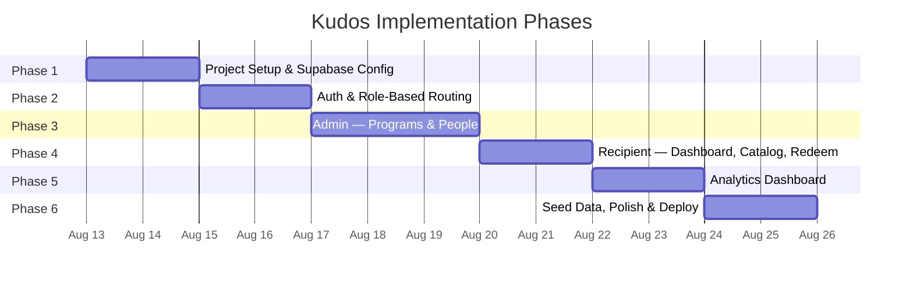
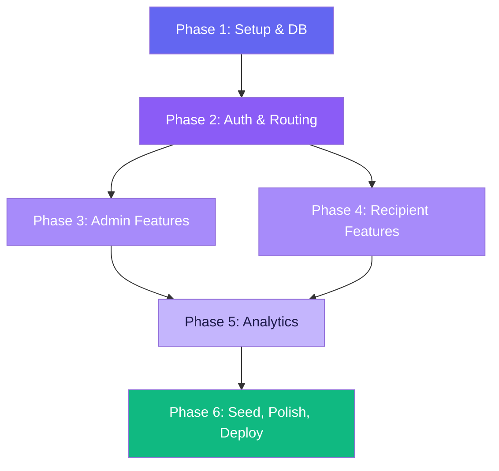
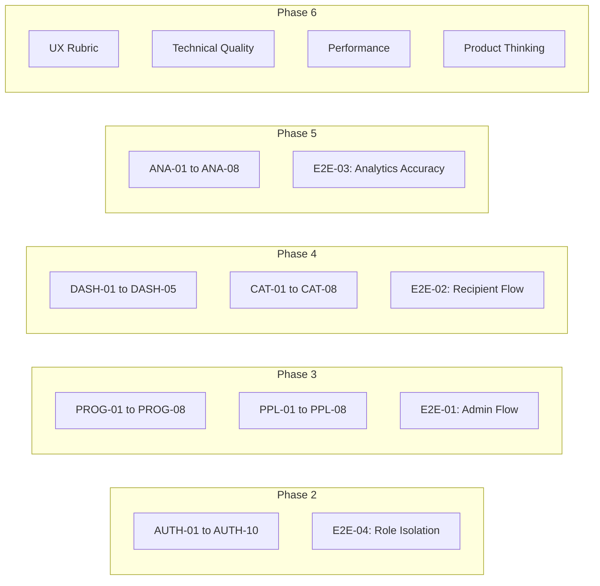

# Implementation Plan: Kudos — Rewards & Recognition Platform

## Overview

This plan breaks the Kudos MVP into **6 sequential phases**, each producing a working, testable increment. Phases are ordered by dependency — foundation first, features second, polish last.

**Estimated Total Duration**: 12–15 working days (solo developer)

### Companion Documents

This plan is designed to be used alongside two companion documents that define **what to test** and **how to score** the final output:

| Document | Purpose |
|----------|---------|
| [Edge-Case.md](file:///c:/Users/KIIT0001/Desktop/PM%20Projects/Kudos/Edge-Case.md) | 80+ edge case scenarios across 8 categories — referenced in each phase's testing checklist |
| [evals.md](file:///c:/Users/KIIT0001/Desktop/PM%20Projects/Kudos/evals.md) | Evaluation rubric with functional test IDs, UX scoring, performance benchmarks, and end-to-end test scripts |

Each phase below includes **Edge Cases to Test** and **Eval Test IDs** that should be verified before marking the phase complete.

---

## Phase Map



---

## Phase 1: Project Scaffolding & Database Foundation

**Duration**: ~2 days
**Goal**: A running Vite + React app connected to a fully-provisioned Supabase database with all tables, indexes, RLS policies, and server-side functions in place.

### 1.1 — Initialize the Project

| Task | Details |
|------|---------|
| Scaffold Vite + React | `npx -y create-vite@latest ./ --template react` |
| Install core dependencies | `react-router-dom`, `@supabase/supabase-js`, `@tanstack/react-query`, `recharts`, `lucide-react` |
| Install dev dependencies | `tailwindcss`, `postcss`, `autoprefixer` |
| Configure Tailwind | `tailwind.config.js` with custom color palette, fonts (Inter via Google Fonts) |
| Create `src/styles/index.css` | Tailwind directives (`@tailwind base/components/utilities`) + CSS custom properties for theme tokens |
| Set up `vite.config.js` | Path aliases (`@/` → `src/`) for clean imports |

**Files Created**:
- `vite.config.js`
- `tailwind.config.js`
- `postcss.config.js`
- `src/styles/index.css`
- `src/main.jsx`
- `.env.local` (template with `VITE_SUPABASE_URL`, `VITE_SUPABASE_ANON_KEY`)

### 1.2 — Supabase Project Setup

| Task | Details |
|------|---------|
| Create Supabase project | Via [supabase.com](https://supabase.com) dashboard |
| Enable Email Auth | Settings → Auth → Email provider (disable email confirmation for dev speed) |
| Copy API credentials | Project URL + anon key → `.env.local` |
| Create Supabase client | `src/config/supabase.js` — initialize and export the client |

**File Created**:
- `src/config/supabase.js`

### 1.3 — Database Schema & Policies

Run the following SQL migrations in order via Supabase SQL Editor:

| Migration | What It Does |
|-----------|-------------|
| `001_create_tables.sql` | Creates all 7 tables: `organizations`, `users`, `reward_programs`, `transactions`, `catalog_items`, `redemptions`, `kudos` with constraints and indexes |
| `002_rls_policies.sql` | Enables RLS on every table; creates SELECT/INSERT/UPDATE policies scoped by role and `org_id` |
| `003_rpc_functions.sql` | Creates atomic database functions: `credit_points()`, `debit_points()`, `redeem_reward()`, `get_points_summary()`, `get_top_recipients()`, `get_program_breakdown()` |

**Files Created**:
- `supabase/migrations/001_create_tables.sql`
- `supabase/migrations/002_rls_policies.sql`
- `supabase/migrations/003_rpc_functions.sql`

### 1.4 — Design System Foundation

| Task | Details |
|------|---------|
| Color palette | Define primary (indigo/violet), secondary (emerald), neutral (slate), danger (rose), warning (amber) |
| Typography | Import Inter from Google Fonts; set heading/body scales |
| Shared components | `Button`, `Modal`, `Badge`, `StatCard`, `LoadingSpinner`, `EmptyState` |
| Dark mode | `ThemeContext` with `localStorage` persistence; Tailwind `darkMode: 'class'` |

**Files Created**:
- `src/context/ThemeContext.jsx`
- `src/components/shared/Button.jsx`
- `src/components/shared/Modal.jsx`
- `src/components/shared/Badge.jsx`
- `src/components/shared/StatCard.jsx`
- `src/components/shared/LoadingSpinner.jsx`
- `src/components/shared/EmptyState.jsx`

### Phase 1 — Exit Criteria

- [x] `npm run dev` serves the app at `localhost:5173`
- [x] Supabase client connects successfully (no console errors)
- [x] All 7 tables exist in Supabase with RLS enabled
- [x] Shared components render correctly in isolation
- [x] Dark/light mode toggle works

### Phase 1 — Edge Cases to Test

| Ref | Scenario | Source |
|-----|----------|--------|
| 8.5 | Supabase service temporarily unavailable — app shows error state, not crash | [Edge-Case.md §8](file:///c:/Users/KIIT0001/Desktop/PM%20Projects/Kudos/Edge-Case.md) |
| 7.7 | Dark mode toggle mid-animation — transition is smooth | [Edge-Case.md §7](file:///c:/Users/KIIT0001/Desktop/PM%20Projects/Kudos/Edge-Case.md) |
| DATA-04 | RLS enforcement — cross-org queries return empty, not error | [Edge-Case.md §8](file:///c:/Users/KIIT0001/Desktop/PM%20Projects/Kudos/Edge-Case.md) |

### Phase 1 — Eval Criteria

| Eval ID | Criteria | Source |
|---------|----------|--------|
| DATA-04 | RLS enforcement — admin from Org A cannot see Org B | [evals.md §3.2](file:///c:/Users/KIIT0001/Desktop/PM%20Projects/Kudos/evals.md) |
| DATA-05 | RLS enforcement — recipient cannot access admin-only data | [evals.md §3.2](file:///c:/Users/KIIT0001/Desktop/PM%20Projects/Kudos/evals.md) |
| Code Structure | Clear separation: pages / components / hooks / config / lib | [evals.md §3.1](file:///c:/Users/KIIT0001/Desktop/PM%20Projects/Kudos/evals.md) |

---

## Phase 2: Authentication & Role-Based Routing

**Duration**: ~2 days
**Goal**: Users can sign up (choosing Admin or Recipient), log in, and are routed to the correct dashboard. Unauthorized access is blocked.

### 2.1 — Auth Context & Hooks

| Task | Details |
|------|---------|
| `AuthContext.jsx` | Listens to `supabase.auth.onAuthStateChange`; fetches user profile from `users` table; exposes `{ user, profile, loading, signIn, signUp, signOut }` |
| `useAuth.js` | Convenience hook wrapping `useContext(AuthContext)` |

**Files Created**:
- `src/context/AuthContext.jsx`
- `src/hooks/useAuth.js`

### 2.2 — Auth Pages

| Page | Key Details |
|------|-------------|
| `LoginPage.jsx` | Email + password form; error handling; redirect to role-appropriate dashboard on success |
| `SignupPage.jsx` | Name, email, password, role dropdown (Admin/Recipient); creates Supabase auth user → inserts row in `users` table; auto-creates org for admin or joins existing org for recipient |

**Design Notes**:
- Split-screen layout: illustration/branding on left, form on right
- Glassmorphism card for the form
- Animated transitions between login ↔ signup
- Form validation with inline error messages

**Files Created**:
- `src/pages/LoginPage.jsx`
- `src/pages/SignupPage.jsx`

### 2.3 — Route Protection & Layout Shells

| Task | Details |
|------|---------|
| `ProtectedRoute.jsx` | Checks auth state + role; redirects to `/login` if unauthenticated or to the correct dashboard if wrong role |
| `AdminLayout.jsx` | Sidebar + TopBar + `<Outlet />` for admin pages |
| `RecipientLayout.jsx` | Sidebar + TopBar + `<Outlet />` for recipient pages |
| `Sidebar.jsx` | Role-aware navigation links with active state, icons (Lucide) |
| `TopBar.jsx` | User avatar, name, points balance (recipient), dark mode toggle, logout |

**Files Created**:
- `src/components/auth/ProtectedRoute.jsx`
- `src/components/layout/AdminLayout.jsx`
- `src/components/layout/RecipientLayout.jsx`
- `src/components/layout/Sidebar.jsx`
- `src/components/layout/TopBar.jsx`

### 2.4 — Router Setup

```
App.jsx
├── /login              → LoginPage
├── /signup             → SignupPage
├── /admin/*            → ProtectedRoute(admin) → AdminLayout
│   ├── dashboard       → AdminDashboard (placeholder)
│   ├── programs        → ProgramsPage (placeholder)
│   ├── people          → PeoplePage (placeholder)
│   └── analytics       → AnalyticsPage (placeholder)
└── /app/*              → ProtectedRoute(recipient) → RecipientLayout
    ├── dashboard       → RecipientDashboard (placeholder)
    ├── catalog         → CatalogPage (placeholder)
    └── history         → HistoryPage (placeholder)
```

**Files Modified**:
- `src/App.jsx` — full router configuration

### Phase 2 — Exit Criteria

- [ ] Admin signup → redirected to `/admin/dashboard`
- [ ] Recipient signup → redirected to `/app/dashboard`
- [ ] Login works for both roles with correct redirect
- [ ] Visiting `/admin/*` while logged in as recipient → redirect to `/app/dashboard`
- [ ] Visiting any protected route while logged out → redirect to `/login`
- [ ] Sidebar shows correct links per role
- [ ] Logout clears session and returns to `/login`

### Phase 2 — Edge Cases to Test

| Ref | Scenario | Source |
|-----|----------|--------|
| 1.1 | Signup with an existing email — clear error message | [Edge-Case.md §1](file:///c:/Users/KIIT0001/Desktop/PM%20Projects/Kudos/Edge-Case.md) |
| 1.2 | Wrong password — generic error (no field enumeration) | [Edge-Case.md §1](file:///c:/Users/KIIT0001/Desktop/PM%20Projects/Kudos/Edge-Case.md) |
| 1.3 | Session expires mid-interaction — redirect to login | [Edge-Case.md §1](file:///c:/Users/KIIT0001/Desktop/PM%20Projects/Kudos/Edge-Case.md) |
| 1.4 | Logout in one tab — both tabs reflect logged-out state | [Edge-Case.md §1](file:///c:/Users/KIIT0001/Desktop/PM%20Projects/Kudos/Edge-Case.md) |
| 1.5 | Recipient navigates to `/admin/*` — silent redirect | [Edge-Case.md §1](file:///c:/Users/KIIT0001/Desktop/PM%20Projects/Kudos/Edge-Case.md) |
| 1.7 | Auth loading state — show spinner, never flash login page | [Edge-Case.md §1](file:///c:/Users/KIIT0001/Desktop/PM%20Projects/Kudos/Edge-Case.md) |
| 1.8 | Empty name on signup — inline validation error | [Edge-Case.md §1](file:///c:/Users/KIIT0001/Desktop/PM%20Projects/Kudos/Edge-Case.md) |
| 1.10 | Rapid clicks on Sign Up button — only one request | [Edge-Case.md §1](file:///c:/Users/KIIT0001/Desktop/PM%20Projects/Kudos/Edge-Case.md) |

### Phase 2 — Eval Test IDs

| Eval ID | Criteria | Source |
|---------|----------|--------|
| AUTH-01 to AUTH-10 | Full auth test suite (signup, login, logout, route protection, session persistence) | [evals.md §1.1](file:///c:/Users/KIIT0001/Desktop/PM%20Projects/Kudos/evals.md) |
| E2E-04 | Role isolation — recipient cannot access admin routes | [evals.md §6](file:///c:/Users/KIIT0001/Desktop/PM%20Projects/Kudos/evals.md) |

---

## Phase 3: Admin Features — Programs & People Management

**Duration**: ~3 days
**Goal**: Admins can create/edit/deactivate reward programs and manage recipients (view roster, credit/debit points, view individual history).

### 3.1 — Reward Program Management

| Task | Details |
|------|---------|
| `usePrograms.js` | TanStack Query hook: `useQuery` for listing programs; `useMutation` for create, update, toggle active |
| `ProgramList.jsx` | Grid of program cards with status badges, point values, trigger type indicators |
| `ProgramCard.jsx` | Card component showing program name, description, trigger type, points, active/inactive badge, edit/deactivate actions |
| `ProgramForm.jsx` | Modal form for create/edit: name, description, trigger type (manual/rule), rule_metric + rule_threshold (shown conditionally when trigger_type = 'rule'), points_value |
| `ProgramsPage.jsx` | Full page: header with "Create Program" button + search/filter + ProgramList |

**Interaction Details**:
- Clicking "Create Program" opens `ProgramForm` in a modal
- Card has a ⋮ menu with Edit and Deactivate/Activate actions
- Deactivating shows a confirmation dialog
- Success/error toasts on mutations
- Empty state when no programs exist yet

**Files Created**:
- `src/hooks/usePrograms.js`
- `src/components/programs/ProgramList.jsx`
- `src/components/programs/ProgramCard.jsx`
- `src/components/programs/ProgramForm.jsx`
- `src/pages/admin/ProgramsPage.jsx`

### 3.2 — People Management

| Task | Details |
|------|---------|
| `usePeople.js` | TanStack Query hook: fetch all users in org with balances; individual user transaction history |
| `PeopleTable.jsx` | Sortable table: name, email, role, points balance, actions (credit/debit, view history) |
| `CreditDebitModal.jsx` | Modal: select credit or debit, enter points amount, reason (required), optional program link; calls `credit_points()` or `debit_points()` RPC |
| `UserHistory.jsx` | Slide-over panel or modal showing a user's full transaction log: date, type, points, reason, running balance |
| `PeoplePage.jsx` | Full page: header with search bar + PeopleTable |

**Interaction Details**:
- Table rows are clickable → opens `UserHistory`
- "Credit Points" and "Debit Points" buttons on each row
- Points balance updates immediately after mutation (optimistic update via React Query)
- Search/filter by name or email
- Sort by name, balance, or join date

**Files Created**:
- `src/hooks/usePeople.js`
- `src/components/people/PeopleTable.jsx`
- `src/components/people/CreditDebitModal.jsx`
- `src/components/people/UserHistory.jsx`
- `src/pages/admin/PeoplePage.jsx`

### 3.3 — Admin Dashboard (Overview)

| Task | Details |
|------|---------|
| `AdminDashboard.jsx` | Summary view with StatCards: total users, total points issued, total redemptions, active programs |
| Quick stats | Pulled via simple Supabase queries (count, sum) |
| Recent activity | Last 10 transactions across the org |

**Files Created/Modified**:
- `src/pages/admin/AdminDashboard.jsx` (replace placeholder)

### Phase 3 — Exit Criteria

- [ ] Admin can create a reward program with all fields; it appears in the program list
- [ ] Admin can edit program name, description, points value
- [ ] Admin can deactivate/reactivate a program
- [ ] Admin can view all recipients with current point balances
- [ ] Admin can credit points to a recipient — balance updates immediately
- [ ] Admin can debit points from a recipient
- [ ] Admin can view a recipient's full transaction history
- [ ] Admin dashboard shows correct summary stats
- [ ] All mutations show success/error feedback

### Phase 3 — Edge Cases to Test

| Ref | Scenario | Source |
|-----|----------|--------|
| 2.1 | Credit 0 points — blocked | [Edge-Case.md §2](file:///c:/Users/KIIT0001/Desktop/PM%20Projects/Kudos/Edge-Case.md) |
| 2.2 | Credit negative points — blocked | [Edge-Case.md §2](file:///c:/Users/KIIT0001/Desktop/PM%20Projects/Kudos/Edge-Case.md) |
| 2.3 | Debit more than balance — block or warn | [Edge-Case.md §2](file:///c:/Users/KIIT0001/Desktop/PM%20Projects/Kudos/Edge-Case.md) |
| 2.4 | Two admins credit same user simultaneously — both apply | [Edge-Case.md §2](file:///c:/Users/KIIT0001/Desktop/PM%20Projects/Kudos/Edge-Case.md) |
| 2.7 | Transaction + balance update atomicity | [Edge-Case.md §2](file:///c:/Users/KIIT0001/Desktop/PM%20Projects/Kudos/Edge-Case.md) |
| 2.9 | Credit without reason — blocked | [Edge-Case.md §2](file:///c:/Users/KIIT0001/Desktop/PM%20Projects/Kudos/Edge-Case.md) |
| 3.1 | Create program with 0 points — blocked | [Edge-Case.md §3](file:///c:/Users/KIIT0001/Desktop/PM%20Projects/Kudos/Edge-Case.md) |
| 3.2 | Rule-based program with empty metric — blocked | [Edge-Case.md §3](file:///c:/Users/KIIT0001/Desktop/PM%20Projects/Kudos/Edge-Case.md) |
| 3.4 | Deactivate program with existing transactions — history preserved | [Edge-Case.md §3](file:///c:/Users/KIIT0001/Desktop/PM%20Projects/Kudos/Edge-Case.md) |
| 3.8 | Empty program list — encouraging empty state | [Edge-Case.md §3](file:///c:/Users/KIIT0001/Desktop/PM%20Projects/Kudos/Edge-Case.md) |
| 6.5 | Accidental credit to wrong user — admin can debit to correct | [Edge-Case.md §6](file:///c:/Users/KIIT0001/Desktop/PM%20Projects/Kudos/Edge-Case.md) |
| 6.9 | Admin from Org A cannot see Org B's users | [Edge-Case.md §6](file:///c:/Users/KIIT0001/Desktop/PM%20Projects/Kudos/Edge-Case.md) |

### Phase 3 — Eval Test IDs

| Eval ID | Criteria | Source |
|---------|----------|--------|
| PROG-01 to PROG-08 | Full program management test suite | [evals.md §1.2](file:///c:/Users/KIIT0001/Desktop/PM%20Projects/Kudos/evals.md) |
| PPL-01 to PPL-08 | Full people management test suite | [evals.md §1.3](file:///c:/Users/KIIT0001/Desktop/PM%20Projects/Kudos/evals.md) |
| DATA-01 | Credit + balance atomicity | [evals.md §3.2](file:///c:/Users/KIIT0001/Desktop/PM%20Projects/Kudos/evals.md) |
| DATA-03 | Balance consistency check | [evals.md §3.2](file:///c:/Users/KIIT0001/Desktop/PM%20Projects/Kudos/evals.md) |
| DATA-07 | Input validation — no 0-point programs or transactions | [evals.md §3.2](file:///c:/Users/KIIT0001/Desktop/PM%20Projects/Kudos/evals.md) |
| E2E-01 | Admin creates program and credits points — full flow | [evals.md §6](file:///c:/Users/KIIT0001/Desktop/PM%20Projects/Kudos/evals.md) |

---

## Phase 4: Recipient Features — Dashboard, Catalog & Redemption

**Duration**: ~2 days
**Goal**: Recipients can view their points, activity feed, browse a rewards catalog, and redeem rewards.

### 4.1 — Recipient Dashboard

| Task | Details |
|------|---------|
| `PointsBalanceCard.jsx` | Large, prominent display of current balance with a visual indicator (gradient, animation) |
| `ActivityFeed.jsx` | Chronological list of recent transactions: earned points, redemptions, manual credits — with icons, timestamps, and reasons |
| `QuickActions.jsx` | Shortcut buttons: "Browse Rewards", "View History" |
| `RecipientDashboard.jsx` | Assembles the above components in a responsive grid layout |

**Design Notes**:
- Balance card uses a gradient background with subtle animation
- Activity feed items have type-specific icons and color coding (green for earned, red for redeemed)
- Responsive: single column on mobile, multi-column on desktop

**Files Created**:
- `src/components/dashboard/PointsBalanceCard.jsx`
- `src/components/dashboard/ActivityFeed.jsx`
- `src/components/dashboard/QuickActions.jsx`
- `src/pages/recipient/RecipientDashboard.jsx` (replace placeholder)

### 4.2 — Rewards Catalog

| Task | Details |
|------|---------|
| `useCatalog.js` | TanStack Query hook: fetch all catalog items |
| `CatalogGrid.jsx` | Responsive grid of reward cards, filterable by category (All / Gift Cards / Merchandise / Experiences) |
| `CatalogCard.jsx` | Card: image, name, description, point cost, category badge, "Redeem" button (disabled if insufficient balance) |
| `CatalogPage.jsx` | Full page with category filter tabs + search + grid |

**Design Notes**:
- Cards have hover zoom effect on images
- "Redeem" button shows remaining points needed if balance is insufficient
- Category filter as pill/tab navigation at the top

**Files Created**:
- `src/hooks/useCatalog.js`
- `src/components/catalog/CatalogGrid.jsx`
- `src/components/catalog/CatalogCard.jsx`
- `src/pages/recipient/CatalogPage.jsx` (replace placeholder)

### 4.3 — Redemption Flow

| Task | Details |
|------|---------|
| `useRedemptions.js` | TanStack Query hook: `useMutation` calling `redeem_reward()` RPC; `useQuery` for user's redemption history |
| `RedeemModal.jsx` | Confirmation modal: shows reward details, point cost, current balance, balance after redemption; "Confirm Redeem" button |
| Balance validation | Client-side check before showing modal; server-side check in RPC function |

**Flow**:
```
Click "Redeem" → RedeemModal opens → User confirms →
    → RPC: redeem_reward() →
        → INSERT redemption
        → INSERT transaction (type='redeem')
        → UPDATE user points_balance
    → Success: show confirmation animation, update balance
    → Error: show error message (e.g., insufficient points race condition)
```

**Files Created**:
- `src/hooks/useRedemptions.js`
- `src/components/catalog/RedeemModal.jsx`

### 4.4 — Transaction History Page

| Task | Details |
|------|---------|
| `useTransactions.js` | TanStack Query hook: fetch paginated transactions for current user |
| `HistoryPage.jsx` | Full page: filterable transaction list (all / earned / redeemed); each entry shows type icon, points, reason, date |

**Files Created**:
- `src/hooks/useTransactions.js`
- `src/pages/recipient/HistoryPage.jsx` (replace placeholder)

### Phase 4 — Exit Criteria

- [ ] Recipient dashboard shows correct point balance
- [ ] Activity feed shows recent transactions in chronological order
- [ ] Catalog page displays all catalog items with images and point costs
- [ ] Category filter works correctly
- [ ] Redeem button is disabled when balance is insufficient
- [ ] Redemption flow deducts points and creates a transaction
- [ ] Balance updates immediately after redemption
- [ ] History page shows all past transactions with filtering

### Phase 4 — Edge Cases to Test

| Ref | Scenario | Source |
|-----|----------|--------|
| 4.1 | Balance drops between clicking Redeem and confirming — server-side rejection | [Edge-Case.md §4](file:///c:/Users/KIIT0001/Desktop/PM%20Projects/Kudos/Edge-Case.md) |
| 4.2 | Rapid 5x clicks on Redeem — only one redemption processes | [Edge-Case.md §4](file:///c:/Users/KIIT0001/Desktop/PM%20Projects/Kudos/Edge-Case.md) |
| 4.3 | 0 balance — Redeem buttons disabled with tooltip | [Edge-Case.md §4](file:///c:/Users/KIIT0001/Desktop/PM%20Projects/Kudos/Edge-Case.md) |
| 4.4 | Redeem entire balance — all buttons disabled after | [Edge-Case.md §4](file:///c:/Users/KIIT0001/Desktop/PM%20Projects/Kudos/Edge-Case.md) |
| 4.5 | Catalog image fails to load — placeholder shown | [Edge-Case.md §4](file:///c:/Users/KIIT0001/Desktop/PM%20Projects/Kudos/Edge-Case.md) |
| 4.6 | Empty catalog — "No rewards available" empty state | [Edge-Case.md §4](file:///c:/Users/KIIT0001/Desktop/PM%20Projects/Kudos/Edge-Case.md) |
| 4.7 | Reward costs more than user has ever earned — show progress | [Edge-Case.md §4](file:///c:/Users/KIIT0001/Desktop/PM%20Projects/Kudos/Edge-Case.md) |
| 4.10 | Close modal before animation completes — state is consistent | [Edge-Case.md §4](file:///c:/Users/KIIT0001/Desktop/PM%20Projects/Kudos/Edge-Case.md) |
| 7.9 | Press Escape — modal closes | [Edge-Case.md §7](file:///c:/Users/KIIT0001/Desktop/PM%20Projects/Kudos/Edge-Case.md) |
| 7.10 | Click outside modal — modal closes | [Edge-Case.md §7](file:///c:/Users/KIIT0001/Desktop/PM%20Projects/Kudos/Edge-Case.md) |

### Phase 4 — Eval Test IDs

| Eval ID | Criteria | Source |
|---------|----------|--------|
| DASH-01 to DASH-05 | Full recipient dashboard test suite | [evals.md §1.4](file:///c:/Users/KIIT0001/Desktop/PM%20Projects/Kudos/evals.md) |
| CAT-01 to CAT-08 | Full catalog and redemption test suite | [evals.md §1.5](file:///c:/Users/KIIT0001/Desktop/PM%20Projects/Kudos/evals.md) |
| DATA-02 | Redeem + balance atomicity | [evals.md §3.2](file:///c:/Users/KIIT0001/Desktop/PM%20Projects/Kudos/evals.md) |
| E2E-02 | Recipient redeems a reward — full flow (8 steps) | [evals.md §6](file:///c:/Users/KIIT0001/Desktop/PM%20Projects/Kudos/evals.md) |

---

## Phase 5: Analytics Dashboard

**Duration**: ~2 days
**Goal**: Admin analytics page with 4 real, data-driven charts.

### 5.1 — Analytics Hooks

| Task | Details |
|------|---------|
| `useAnalytics.js` | TanStack Query hook wrapping three Supabase RPC calls: `get_points_summary()`, `get_top_recipients()`, `get_program_breakdown()` |

**File Created**:
- `src/hooks/useAnalytics.js`

### 5.2 — Chart Components (Recharts)

| Component | Chart Type | Data Source | Description |
|-----------|-----------|-------------|-------------|
| `PointsIssuedVsRedeemed.jsx` | **Area Chart** | `get_points_summary()` | Monthly comparison — issued (blue area) vs redeemed (rose area) over time |
| `RedemptionRateChart.jsx` | **Line Chart** | `get_points_summary()` | Derived: `(redeemed / issued) × 100` per month — shows engagement trend |
| `TopRecipientsTable.jsx` | **Styled Table** | `get_top_recipients()` | Ranked table: rank, avatar, name, total points earned — with bar indicators |
| `ProgramBreakdown.jsx` | **Donut/Pie Chart** | `get_program_breakdown()` | Points distribution across active reward programs |

**Design Notes**:
- Charts use a consistent color palette derived from the design system
- Responsive: charts resize gracefully; table becomes scrollable on mobile
- Tooltips on hover showing exact values
- Animated chart entry transitions

**Files Created**:
- `src/components/analytics/PointsIssuedVsRedeemed.jsx`
- `src/components/analytics/RedemptionRateChart.jsx`
- `src/components/analytics/TopRecipientsTable.jsx`
- `src/components/analytics/ProgramBreakdown.jsx`

### 5.3 — Analytics Page Assembly

| Task | Details |
|------|---------|
| `AnalyticsPage.jsx` | 4 StatCards at top (total issued, total redeemed, redemption rate, active programs) + 2×2 chart grid below |
| Date range filter | Optional: dropdown to filter analytics by time period (Last 30 days, Last 90 days, All time) |

**File Modified**:
- `src/pages/admin/AnalyticsPage.jsx` (replace placeholder)

### Phase 5 — Exit Criteria

- [ ] Points Issued vs Redeemed chart renders with real transaction data
- [ ] Redemption Rate chart shows a meaningful trend line
- [ ] Top Recipients table is populated and correctly ranked
- [ ] Program Breakdown pie/donut shows distribution across programs
- [ ] Summary stat cards show correct totals
- [ ] Charts are responsive and have hover tooltips
- [ ] Empty states are handled gracefully (no data → helpful message, not a broken chart)

### Phase 5 — Edge Cases to Test

| Ref | Scenario | Source |
|-----|----------|--------|
| 5.1 | No transactions — charts show empty state, not broken | [Edge-Case.md §5](file:///c:/Users/KIIT0001/Desktop/PM%20Projects/Kudos/Edge-Case.md) |
| 5.2 | All transactions in single day — chart renders a single point | [Edge-Case.md §5](file:///c:/Users/KIIT0001/Desktop/PM%20Projects/Kudos/Edge-Case.md) |
| 5.3 | Very large transaction volumes (10k+) — loads within 2s | [Edge-Case.md §5](file:///c:/Users/KIIT0001/Desktop/PM%20Projects/Kudos/Edge-Case.md) |
| 5.4 | Redemption rate exceeds 100% — display handles gracefully | [Edge-Case.md §5](file:///c:/Users/KIIT0001/Desktop/PM%20Projects/Kudos/Edge-Case.md) |
| 5.7 | All points to one person — pie chart shows one full slice | [Edge-Case.md §5](file:///c:/Users/KIIT0001/Desktop/PM%20Projects/Kudos/Edge-Case.md) |
| 5.8 | Very narrow browser (<375px) — charts resize without overlap | [Edge-Case.md §5](file:///c:/Users/KIIT0001/Desktop/PM%20Projects/Kudos/Edge-Case.md) |
| 5.9 | Analytics RPC timeout — error state with retry button | [Edge-Case.md §5](file:///c:/Users/KIIT0001/Desktop/PM%20Projects/Kudos/Edge-Case.md) |
| 5.10 | Rapid page switching — stale queries cancelled | [Edge-Case.md §5](file:///c:/Users/KIIT0001/Desktop/PM%20Projects/Kudos/Edge-Case.md) |

### Phase 5 — Eval Test IDs

| Eval ID | Criteria | Source |
|---------|----------|--------|
| ANA-01 to ANA-08 | Full analytics dashboard test suite | [evals.md §1.6](file:///c:/Users/KIIT0001/Desktop/PM%20Projects/Kudos/evals.md) |
| E2E-03 | Analytics reflect real activity — 5-point accuracy check | [evals.md §6](file:///c:/Users/KIIT0001/Desktop/PM%20Projects/Kudos/evals.md) |

---

## Phase 6: Seed Data, Polish & Deployment

**Duration**: ~2 days
**Goal**: The platform is seeded with realistic demo data, visually polished, and deployed to a public URL.

### 6.1 — Seed Data

| Task | Details |
|------|---------|
| `003_seed_data.sql` | Populate: 1 org, 2 admins, 8-10 recipients, 4 programs, 50-80 transactions (spread over 6 months), 6-8 catalog items, 10-15 redemptions |
| Catalog images | Generate or source 6-8 reward images; upload to Supabase Storage |
| Realistic distribution | Transactions should have varying dates, amounts, and types to make charts look authentic |

**File Created/Updated**:
- `supabase/migrations/003_seed_data.sql`

### 6.2 — Visual Polish

| Task | Details |
|------|---------|
| Animations | Page transition fade-ins; card hover lifts; chart entry animations; button micro-interactions |
| Loading states | Skeleton loaders for tables and charts (not just spinners) |
| Error handling | Friendly error boundaries with retry buttons; toast notifications for all mutations |
| Responsive audit | Test all pages at mobile (375px), tablet (768px), desktop (1280px+) |
| Typography audit | Consistent heading hierarchy, line heights, font weights |
| Color consistency | Verify all components use design system tokens |
| Accessibility | Focus rings, ARIA labels on interactive elements, sufficient color contrast |

### 6.3 — Performance Optimization

| Task | Details |
|------|---------|
| Lazy loading | `React.lazy()` for admin and recipient page groups |
| Image optimization | `loading="lazy"` on catalog images; WebP format if possible |
| Bundle analysis | `npx vite-bundle-analyzer` — verify no unnecessary dependencies |
| Query optimization | Ensure all Supabase queries use `.select()` with specific columns (not `*`) where possible |

### 6.4 — Deployment

| Task | Details |
|------|---------|
| GitHub repo | Push code to GitHub (public or private) |
| Vercel setup | Connect repo → Vercel; set build command: `npm run build`, output: `dist` |
| Environment variables | Add `VITE_SUPABASE_URL` and `VITE_SUPABASE_ANON_KEY` in Vercel project settings |
| Custom domain | Optional: configure a custom domain or use the `.vercel.app` URL |
| Verify deployment | Test all user flows on the live URL |

### 6.5 — Final Walkthrough & Case Study

| Task | Details |
|------|---------|
| End-to-end test | Admin login → create program → credit points → Recipient login → check balance → redeem → Admin analytics shows updated data |
| Case study draft | Problem → Solution → Key Product Decisions → Screenshots → What's Next |

### Phase 6 — Exit Criteria

- [ ] Platform loads with realistic demo data — no empty states on first visit
- [ ] All charts show meaningful data patterns
- [ ] All pages render correctly on mobile, tablet, and desktop
- [ ] Loading, error, and empty states are handled throughout
- [ ] App is deployed to Vercel with a working public URL
- [ ] End-to-end flow works: signup → create program → credit → redeem → analytics
- [ ] Case study is written

### Phase 6 — Edge Cases to Test (Cross-Cutting)

| Ref | Scenario | Source |
|-----|----------|--------|
| 7.1 | JavaScript disabled — `<noscript>` message shown | [Edge-Case.md §7](file:///c:/Users/KIIT0001/Desktop/PM%20Projects/Kudos/Edge-Case.md) |
| 7.2 | Network offline during mutation — error toast | [Edge-Case.md §7](file:///c:/Users/KIIT0001/Desktop/PM%20Projects/Kudos/Edge-Case.md) |
| 7.3 | Browser resize during chart render — smooth reflow | [Edge-Case.md §7](file:///c:/Users/KIIT0001/Desktop/PM%20Projects/Kudos/Edge-Case.md) |
| 7.5 | Very long user name — truncated with ellipsis | [Edge-Case.md §7](file:///c:/Users/KIIT0001/Desktop/PM%20Projects/Kudos/Edge-Case.md) |
| 8.1 | Modified anon key in DevTools — RLS still enforces | [Edge-Case.md §8](file:///c:/Users/KIIT0001/Desktop/PM%20Projects/Kudos/Edge-Case.md) |
| 8.2 | Direct Supabase REST call bypassing UI — RLS blocks | [Edge-Case.md §8](file:///c:/Users/KIIT0001/Desktop/PM%20Projects/Kudos/Edge-Case.md) |
| 8.3 | SQL injection via form fields — parameterized queries block it | [Edge-Case.md §8](file:///c:/Users/KIIT0001/Desktop/PM%20Projects/Kudos/Edge-Case.md) |
| 8.7 | XSS via reason/message field — React escaping neutralizes | [Edge-Case.md §8](file:///c:/Users/KIIT0001/Desktop/PM%20Projects/Kudos/Edge-Case.md) |

### Phase 6 — Eval Criteria (Full Evaluation)

| Category | Weight | Key Checks | Source |
|----------|--------|------------|--------|
| Functional Completeness | 30% | All AUTH, PROG, PPL, DASH, CAT, ANA test IDs pass | [evals.md §1](file:///c:/Users/KIIT0001/Desktop/PM%20Projects/Kudos/evals.md) |
| User Experience & Design | 25% | Visual quality rubric ≥4/5; responsive at 375px, 768px, 1280px | [evals.md §2](file:///c:/Users/KIIT0001/Desktop/PM%20Projects/Kudos/evals.md) |
| Technical Quality | 20% | DATA-01–07 pass; no console errors; RLS verified | [evals.md §3](file:///c:/Users/KIIT0001/Desktop/PM%20Projects/Kudos/evals.md) |
| Performance | 10% | FCP <1.5s, LCP <2.5s, bundle <300KB | [evals.md §4](file:///c:/Users/KIIT0001/Desktop/PM%20Projects/Kudos/evals.md) |
| Product Thinking | 15% | Demo readiness ≥4/5; case study complete with 3+ decisions | [evals.md §5](file:///c:/Users/KIIT0001/Desktop/PM%20Projects/Kudos/evals.md) |
| **E2E Scenarios** | — | E2E-01 through E2E-04 all pass | [evals.md §6](file:///c:/Users/KIIT0001/Desktop/PM%20Projects/Kudos/evals.md) |
| **Quick Checklist** | — | All 14 items pass | [evals.md §8](file:///c:/Users/KIIT0001/Desktop/PM%20Projects/Kudos/evals.md) |

---

## Dependency Graph



> **Note**: Phases 3 and 4 can be worked on in parallel if there are multiple developers, since they share no component dependencies — only the database layer (established in Phase 1) and auth (established in Phase 2).

---

## Risk Mitigation

| Risk | Likelihood | Impact | Mitigation |
|------|-----------|--------|------------|
| **Supabase RLS blocks legitimate queries** | High | Medium | Test every query with both admin and recipient accounts after writing policies; check Supabase logs for policy violations |
| **Points balance desync** | Medium | High | Use database-level atomic functions (`credit_points`, `redeem_reward`) — never update balance from client directly |
| **Charts look empty/boring with little data** | High | Medium | Seed 50-80 transactions across 6 months with realistic variance; don't leave seeding to the end |
| **Auth edge cases (expired sessions, race conditions)** | Medium | Medium | Supabase handles token refresh automatically; add error boundaries around auth-dependent components |
| **Bundle size grows too large** | Low | Low | Lazy-load page groups; monitor with `vite-bundle-analyzer` |

---

## File Creation Summary

| Phase | New Files | Modified Files |
|-------|-----------|----------------|
| **Phase 1** | ~15 | 0 |
| **Phase 2** | ~8 | 1 (`App.jsx`) |
| **Phase 3** | ~10 | 1 (`AdminDashboard.jsx`) |
| **Phase 4** | ~9 | 0 |
| **Phase 5** | ~5 | 1 (`AnalyticsPage.jsx`) |
| **Phase 6** | ~2 | Multiple (polish edits) |
| **Total** | **~49** | **~3 + polish** |

---

## Edge Case Coverage by Phase

Summary of which [Edge-Case.md](file:///c:/Users/KIIT0001/Desktop/PM%20Projects/Kudos/Edge-Case.md) sections are covered in each phase:

| Phase | Edge Case Sections | Scenarios Tested |
|-------|-------------------|-----------------|
| **Phase 1** | §7 (UI), §8 (Data Integrity) | 3 |
| **Phase 2** | §1 (Auth & Sessions) | 8 |
| **Phase 3** | §2 (Points & Balance), §3 (Programs), §6 (People) | 12 |
| **Phase 4** | §4 (Catalog & Redemption), §7 (UI) | 10 |
| **Phase 5** | §5 (Analytics) | 8 |
| **Phase 6** | §7 (UI), §8 (Security) — cross-cutting sweep | 8 |
| **Total** | All 8 sections | **49 of 80+** explicitly tested per phase |

> The remaining ~31 edge cases are lower-priority or naturally covered by the implementations above. A full sweep should be done during Phase 6 polish.

---

## Evaluation Integration

Summary of how [evals.md](file:///c:/Users/KIIT0001/Desktop/PM%20Projects/Kudos/evals.md) maps to the implementation phases:



| Eval Category | When Tested | Phase |
|---------------|-------------|-------|
| Functional: Auth | After auth pages are built | Phase 2 |
| Functional: Programs | After admin features are built | Phase 3 |
| Functional: People | After admin features are built | Phase 3 |
| Functional: Dashboard | After recipient features are built | Phase 4 |
| Functional: Catalog | After recipient features are built | Phase 4 |
| Functional: Analytics | After analytics dashboard is built | Phase 5 |
| UX & Design | During polish pass | Phase 6 |
| Technical Quality | Continuous + final audit | Phase 6 |
| Performance | After production build | Phase 6 |
| Product Thinking | After deployment + case study | Phase 6 |
| E2E Scenarios | Full run after all features complete | Phase 6 |

### Target Score: **75+** (Strong) — aiming for **90+** (Exceptional)
